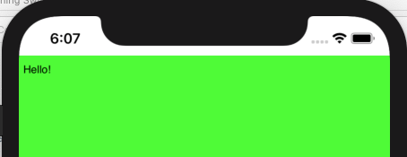
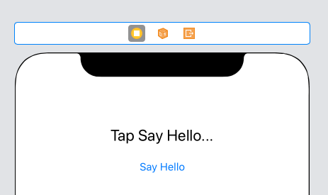
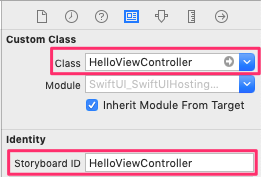
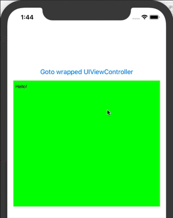

# SwiftUI with UIKit Demo
## Integrating UIKit-based content (UIView or UIViewController) in SwiftUI apps 
**(Updated for Xcode 11 Beta 6)**

Apple provides two protocols which allow you to present **UIView** or **UIViewController** code in a SwiftUI app:

* For **UIView** use **UIViewRepresentable**
* For **UIViewController** use **UIViewControllerRepresentable**

There are WKInterfaceObjectRepresentable, NSViewRepresentable and NSViewControllerRepresentable protocols for WatchKit and AppKit, 
but in this demo we’ll concentrate solely on iOS.

___

## Wrapping UIView-derived content with UIViewRepresentable
As a simple example, SwiftUI does not have an equivalent of **UITextView**.
We can easily create one by wrapping a **UITextView** in a **UIViewRepresentable**:

``` swift
//
//  ContentView.swift
//  SwiftUI-SwiftUIHostingUIKit
//
//  Created by Russell Archer on 19/08/2019.
//  Copyright © 2019 Russell Archer. All rights reserved.
//
// Tested and working with Xcode 11 Beta 6 on Mojave 10.14.6
//

import SwiftUI

/// Wrap a UITextView using UIViewRepresentable to create a TextView that's
/// directly useable in SwiftUI
struct TextView: UIViewRepresentable {
    let text: String

    func makeUIView(context: Context) -> UITextView {
        let tv = UITextView()
        tv.backgroundColor = UIColor.green
        tv.isEditable = true

        return tv
    }

    func updateUIView(_ textView: UITextView, context: Context) {
        textView.text = self.text
    }
}

struct ContentView: View {
    var body: some View {
        VStack {
            TextView(text: "Hello!")  // Use our TextView - simple!
            Spacer()
        }
    }
}

#if DEBUG
struct ContentView_Previews: PreviewProvider {
    static var previews: some View {
        ContentView()
    }
}
#endif
```



___

## Wrapping a UIViewController with UIViewControllerRepresentable
To demonstrate the basic principles involved, do the following in any SwiftUI app:

* Create a **Storyboard** and then add a **UIViewController** to the storyboard in **Interface Builder**.
* Create the UI in the “old non-SwiftUI way” using Interface Builder:



* Give the UIViewController a **Storyboard ID** (I called mine **HelloViewController**).
* Create a new **UIViewController Cocoa Touch Class** called **HelloViewController**.
* In Interface Builder, set the **Custom Class** for the new view controller as **HelloViewController**:



* Create an **Outlet** for the **UILabel** and an **Action** for the **UIButton** in the custom class:

``` swift
//
//  HelloViewController.swift
//  SwiftUI-SwiftUIHostingUIKit
//
//  Created by Russell Archer on 21/08/2019.
//  Copyright © 2019 Russell Archer. All rights reserved.
//

import UIKit
import SwiftUI

// Note that we must make the class *final* error we’ll get a compiler error
// when implementing the UIViewControllerRepresentable protocol

final class HelloViewController: UIViewController {
    @IBOutlet weak var helloLabel: UILabel!
    
    override func viewDidLoad() {
        super.viewDidLoad()
    }
    
    @IBAction func sayHelloTapped(_ sender: Any) {
        helloLabel.text = "Hello 👋"
    }
}
```

* Implement the **UIViewControllerRepresentable** protocol in **HelloViewController**:

``` swift
extension HelloViewController: UIViewControllerRepresentable {
    public func makeUIViewController(context: UIViewControllerRepresentableContext<HelloViewController>) -> HelloViewController {
        // Get a ref to a view controller using its Interface Builder Storyboard ID
        let storyboard = UIStoryboard(name: "Storyboard", bundle: nil)  // Get ref to the storyboard
        return storyboard.instantiateViewController(withIdentifier: "HelloViewController") as! HelloViewController
    }
    
    // Required by the protocol but not needed in this demo
    func updateUIViewController(
        _ uiViewController: HelloViewController,
        context: UIViewControllerRepresentableContext<HelloViewController>) { }
}
```

* Update the main SwiftUI **ContentView** to allow navigation to the new UIViewController:

``` swift
struct ContentView: View {
    var body: some View {
        NavigationView {
            VStack {
                // Navigate to a UIViewController wrapped with UIViewControllerRepresentable
                NavigationLink(destination: HelloViewController()) { Text("Goto wrapped UIViewController") }
                
                TextView(text: "Hello!")
                Spacer()
            }
            .padding()
        }
        .navigationBarTitle(Text("UIViewRepresentable"))
    }
}
```

If you run the app you should see:


